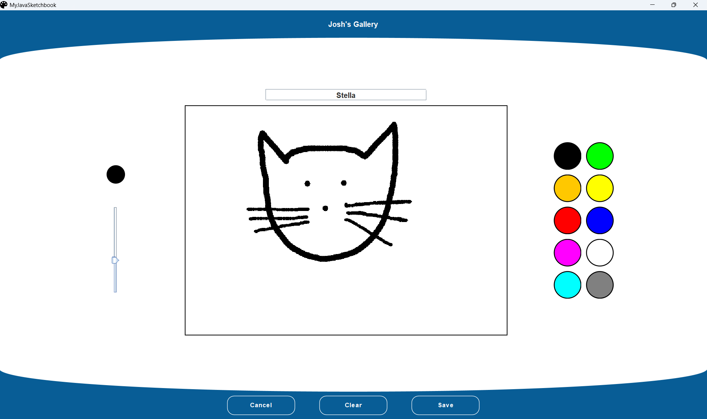

# MyJavaSketchbook

**MyJavaSketchbook** is a Java desktop application that enables users to create, edit, and manage digital drawings through an guided user interface. The application supports cloud-based storage, allowing users to securely save and access their artwork accross multiple devices from anywhere with an internet connection.

## Technologies

- **Architechture:** Apache Maven
- **User Interface:** Java Swing
- **Database:** PostgreSQL (cloud-hosted via AWS and Supabase)
- **Testing:** JUnit with Docker-based PostgreSQL for integration testing

## Install instructions

The application is packaged into a uber-JAR file using the Apache Maven Shade Plugin, bundling all the required dependencies into a single file.

To run the application:

1. Download the [latest release](https://github.com/JoshD898/myJavaSketchbook/releases/tag/1.0).
2. Run the JAR file with a Java Runtime Environment (JRE 11 or higher).

## Screenshots

<table>
  <tr>
    <td></td>
    <td></td>
  </tr>
  <tr>
    <td></td>
    <td></td>
  </tr>
</table>
